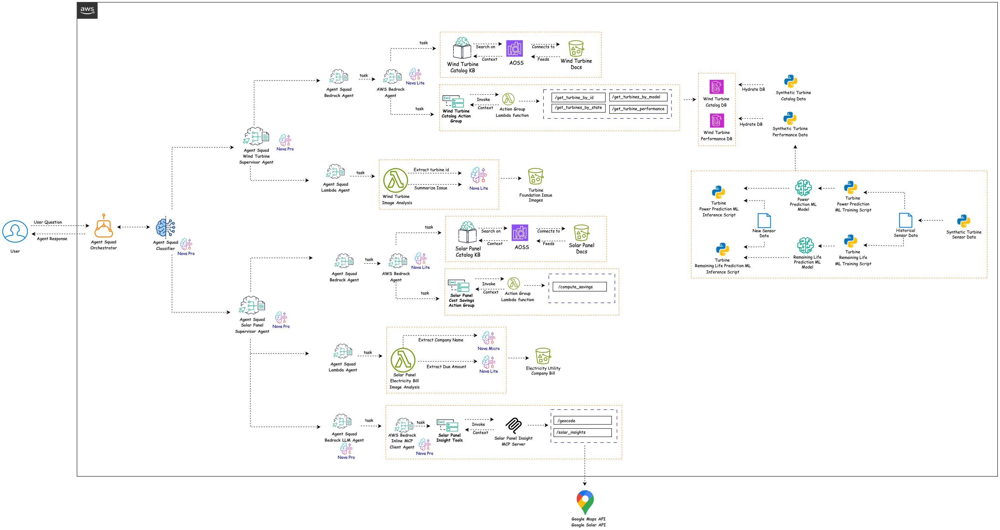

## Challenge:
Industrial maintenance operations in the renewable energy sector face significant hurdles in both wind turbine and solar panel management. For wind turbines, field technicians often struggle with reactive maintenance, leading to costly downtime and inefficient troubleshooting. Accessing up-to-date technical knowledge and best practices is cumbersome, slowing down on-site decision-making. For solar panels, end customers encounter complex choices regarding installation, cost savings, and ongoing maintenance, with limited access to personalized, real-time guidance. Existing solutions lack an integrated, conversational AI that can deliver technical support, predictive maintenance insights, and cost analysis across both field operations and customer-facing scenarios, especially in a multi-modal (text and speech) environment

## Solution:

Our multi-agent AI system streamlines wind turbine operations and solar panel adoption by delivering instant, conversational access to technical knowledge, predictive maintenance insights, and cost analysis through both text and speech interfaces. Field technicians receive concise troubleshooting and maintenance guidance, while end customers benefit from automated cost savings analysis and personalized solar recommendations. The solution leverages real-time data retrieval, image analysis, and orchestrated agent workflows to ensure accurate, actionable responses for both operational and customer-facing scenarios, all optimized for easy use with text-based and speech-based assistants

## RenewableOps AI Assistant - Architecture Diagram

## Solution Details:

The solution primarily uses AWS Agent Squad Multi-Agent framework - https://github.com/awslabs/agent-squad for classifying, orchestrating multiple AI agents

### Agent Squad Classifier:

* Model Used: Amazon Nova Pro
* Purpose: Intelligent routes user queries to respective supervisor agents such as Wind 

### Wind Turbine Agents: Operations & Field Assistant

#### Wind Turbine Catalog Agent

* Model Used: Amazon Nova Lite
* Purpose: Handles technical queries about wind turbine assets, preventive maintenance, troubleshooting, and best practices.
* Implementation: Deployed as an Amazon Bedrock Agent with a knowledge base integration powered by AWS OpenSearch Serverless Vector DB, and Action Group backed by Lambda to interact with DynamoDB

#### Wind Turbine Image Analysis Agent

* Model Used: Amazon Nova Lite
* Purpose: Analyzes turbine foundation and wear issues from images, providing brief, actionable descriptions.
* Implementation: Invoked via a Lambda function that extracts turbine id from user query with Nova Lite, fetches relevant images from S3 and uses Nova Lite for image captioning and issue detection.

#### Supervisor Agent

* Model Used: Amazon Nova Pro (via BedrockLLMAgent)
* Purpose: Orchestrates the workflow between catalog and image analysis agents, ensuring the right agent handles each query.

### Solar Panel Agents: End-Customer Focused

#### Solar Panel Catalog Agent

* Model Used: Amazon Nova Lite
* Purpose: Provides cost savings analysis, cleaning tips, troubleshooting, and maintenance information for solar panels.
* Implementation: Deployed as an Amazon Bedrock Agent with a knowledge base integration powered by AWS OpenSearch Serverless Vector DB, and Action Group backed by Lambda that computes cost savings with Solar Panel based on monthly energy utility bill

#### Electricity Utility Bill Image Analysis Agent

* Model Used: Amazon Nova Lite
* Purpose: Extracts electricity bill amounts from images for cost analysis.
* Implementation: Invoked via a Lambda function that extracts electricity utility company name from user query with Nova Lite, fetches relevant images from S3 and uses Nova Lite to extract the amount due in the bill.

#### Solar Insights Agent

* Model Used: Amazon Nova Pro
* Purpose: Delivers personalized solar insights recommendations, including panel configuration, roof orientation, carbon effect, installation cost, payback period, etc based on user provided address
* Implementation: Utilizes MCP client and server to invoke Geocode and Solar API from Google Maps to extract solar insights potential via AWS Bedrock Inline Agent as MCP client.

#### Supervisor Agent

* Model Used: Amazon Nova Pro (via BedrockLLMAgent)
* Purpose: Manages workflow across catalog, bill analysis, and insights agents, ensuring seamless customer experience
